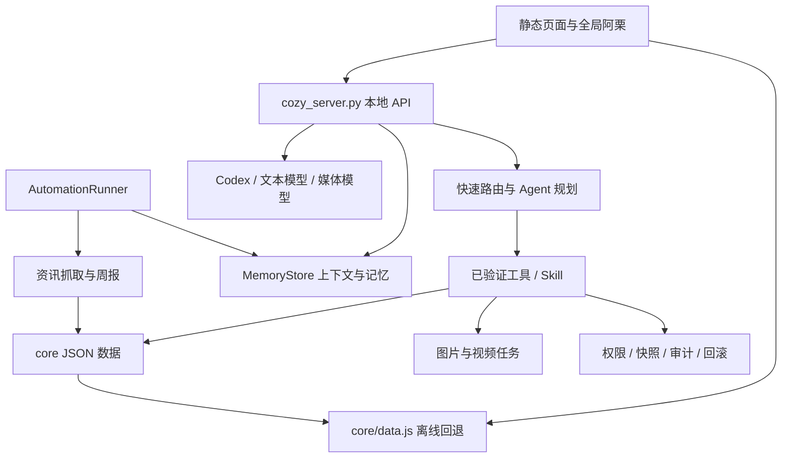
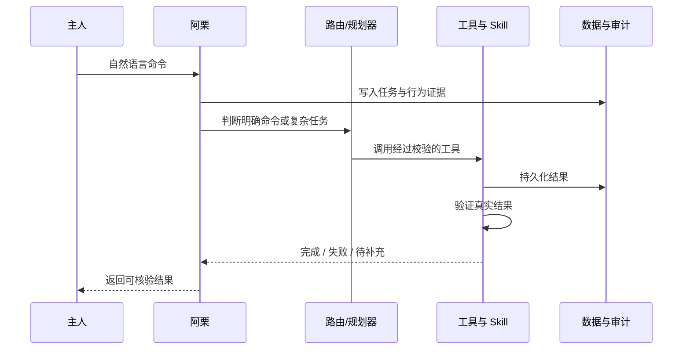
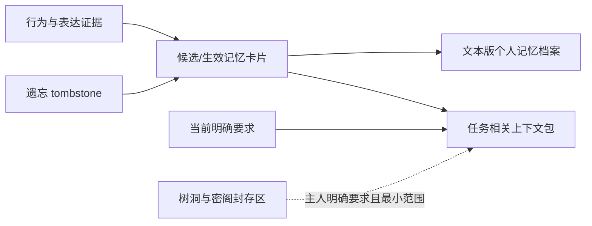

# 栗壳小院：产品说明、PRD 与技术架构

> 文档版本：1.0  
> 当前阶段：本地可用版  
> 产品形态：面向单一主人的本地优先个人 AI 空间

## 1. 产品概述

栗壳小院不是一个把聊天框换皮的 AI 助手，而是一套以“空间”组织生活、学习、信息和记忆的个人系统。

主人通过小院中的不同地点完成不同性质的事情：在公告板获取高质量资讯，在黑板训练产品能力，在果园梳理成长问题，在树洞倾诉，在旅行页保存经历，在照片墙回看生活，并让管家阿栗执行跨模块任务。系统会从持续交互中形成可纠正、可遗忘、有隐私边界的个人记忆。

### 1.1 一句话定位

一个会长期了解主人、能主动整理信息并真正执行任务的私人 AI 小院。

### 1.2 核心价值

- **不是信息堆积，而是有选择地沉淀**：周报、工具、题目、成长线索和旅行记录各归其位。
- **不是每次重新认识，而是持续形成理解**：系统从明确表达和重复行为中自动学习稳定偏好。
- **不是只会回答，而是能够执行**：阿栗通过工具和 Skill 修改内容、归档资料、生成周报和维护系统。
- **不是无边界读取，而是分区记忆**：树洞、密阁和最高级秘密与普通任务上下文严格隔离。
- **不是冷冰冰的后台系统，而是可进入的个人空间**：不同场景承载不同心理预期和交互方式。

## 2. 产品目标与边界

### 2.1 当前目标

1. 主人打开网页后可以直接使用，不需要理解底层技术。
2. 阿栗能够在所有页面被召唤，并完成真实、可验证的操作。
3. 公告板能够按计划整理高信噪比 AI 与产品资讯。
4. 各房间形成清晰分工，同时通过事件和记忆体系适度联动。
5. 系统能够自动维护个人记忆档案，不要求主人每天审核。
6. 本地数据可持久保存，系统修改可追踪、可撤销。

### 2.2 非目标

- 不做多人社区、团队协作、账号体系或复杂权限组织。
- 不追求替代专业知识库、企业工作流或完整项目管理软件。
- 不把树洞内容默认用于资讯、推荐或普通对话。
- 不让模型绕过工具直接宣称“已经完成”。
- 不为了工程形式引入数据库、前端框架、Docker 或复杂构建链。

## 3. 目标用户与典型场景

当前只有一位核心用户：小院主人。

典型需求包括：

- 想快速知道这一周真正重要的 AI 动态，而不是浏览大量低价值新闻。
- 想练习产品思考，并通过长期答题看到能力变化。
- 想记录成长困惑并得到可执行的小实验，而不是泛泛安慰。
- 想倾诉，但不希望隐私内容被普通推荐或任务调用。
- 想让 AI 记住沟通和工作偏好，又不想手工维护记忆列表。
- 想直接吩咐管家归档、添加工具、整理资料，甚至在授权后修改系统本身。

## 4. 空间与功能地图

| 空间 | 核心任务 | 主要输入 | 主要输出 | 记忆规则 |
| --- | --- | --- | --- | --- |
| 主院 | 导航、天气场景、召唤阿栗 | 点击、管家命令 | 页面跳转、任务结果 | 记录普通行为证据 |
| 公告板 | 阅读和整理 AI/产品资讯 | 自动抓取、链接、留言 | 本周报告、历史周报、待读、栗夹 | 阅读与留言形成偏好证据 |
| 黑板 | 每日产品与 AI 问答训练 | 主人答案、资讯、果园线索 | 批改、标准要点、建议、下一题 | 答题表现先作为观察证据 |
| 工具箱 | 管理可实际使用的 AI 工具 | 工具链接、资讯、管家命令 | 工具卡片、分类、使用示例 | 收藏和使用行为形成兴趣证据 |
| 智慧果园 | 梳理成长、选择和方向 | 困惑、计划、复盘 | 种子、分析、小实验、收成 | 进入普通成长记忆候选 |
| 树洞 | 语音优先的私人倾诉 | 语音、轻量文字 | 签语式回应或来回对话 | 原文只进入封存区 |
| 照片墙 | 随机回看生活照片 | 普通照片、旅行照片 | 约十张轮换展示 | 不读取树洞埋藏影像 |
| 出发旅行 | 按地点保存旅行经历 | 日期、地点、照片、感悟 | 旅行摘要、返程记录、感悟 | 有意义的感悟可成为候选记忆 |
| 卧室 | 私密入口和氛围交互 | 灯光点击、书墙三击 | 灯光切换、打开密阁 | 不直接展示记忆原文 |
| 密阁 | 管理个人档案和系统权力 | 记忆操作、权限开关 | 记忆档案、日志、任务卷宗、Skill | 封存内容按最小范围读取 |

## 5. 核心交互逻辑

### 5.1 全局管家阿栗

阿栗始终位于页面左上角，是跨空间统一入口。

处理逻辑：

1. 接收主人自然语言命令。
2. 记录任务状态，主人离开页面后仍可看到“运行中”。
3. 明确命令优先走确定性工具，例如归档、待读、添加分类和状态检查。
4. 模糊或多步骤任务由模型生成工具计划。
5. 工具执行完成后校验结果，再由阿栗返回完成情况。
6. 缺少能力时，在掌院权限下创建并验证新的动态 Skill。

阿栗的回复必须区分：正在处理、已经完成、执行失败和需要主人补充信息。模型不能把“已提交”描述成“已完成”。

### 5.2 公告板

公告板默认打开本周报告，内容结构为：

1. 热点速览
2. 国内外动态
3. 产品相关动态
4. 阿栗总结
5. 给阿栗的留言

每篇资讯保留原始标题和原摘要，并增加 200 字以内的 AI 精炼，重点说明文章中的事实、变化、影响与值得关注之处。资讯支持查看原文、加入或移出待读、收入栗夹。栗夹用于长期归档，并支持少量稳定分类和主人自建分类。

历史报告按完整周日期保存并可展开查看。后台计划在每周一、周三、周六 08:00 更新本周报告，同一周更新同一份报告，不覆盖历史周。

### 5.3 黑板

每日一题覆盖基础理论、真实产品场景、时事分析、评测、记忆系统、原型和 Agent 设计。

答题流程：题目与类型 -> 主人作答 -> AI 润色 -> 标准答案要点 -> 差距与具体建议 -> 下一次训练方向。

资讯和果园问题可成为出题素材，但必须保证主题多样性。单次答题不直接定义主人能力，只有重复证据才形成稳定结论。

### 5.4 智慧果园

果园处理“成长问题”，而不是承担树洞的情绪安慰职责。

每次交流应先澄清真正的问题，再给出一个有根据的解释、两条可能路径和一个小规模下一步实验。原始问题沉淀为“种子”，有效结论沉淀为“结晶/收成”，未解决问题可适度进入黑板题库。

### 5.5 树洞

树洞以语音为主，提供两种模式：

- **签语模式**：主人充分倾诉后，只返回一句基于真实内容、具有画面感的短句；不算命、不泛泛安慰、不强行使用树的比喻。
- **对话模式**：回应一个具体细节，并最多追问一个温和问题。

一天可以记录多次。原文和埋藏影像进入封存区，草坪连续点击五次才显示历史入口。照片墙永不自动读取树洞影像；只有特别具体的记忆才低频生成约 5 秒影像。

### 5.6 记忆档案

密阁默认展示一份自动整理的文本版“我的记忆档案”，而不是让主人面对散乱的技术卡片。观察中的线索、单条记忆、封存密库和系统日志默认折叠。

主人不需要每天批准记忆。明确说“记住”会立即生效；推断偏好至少需要两次一致观察，其他推断通常需要三次证据。候选记忆到期后自动失效，当前指令永远覆盖旧偏好。

## 6. 功能优先级

### P0：当前必须稳定可用

- 本地主院和所有房间可访问。
- 全局阿栗、任务状态和真实工具执行。
- 公告板周报、历史周报、待读和栗夹。
- 黑板答题、批改和历史题。
- 果园种子与交流。
- 树洞语音、双模式回应和封存隔离。
- 照片墙、旅行记录和卧室密阁入口。
- 自动记忆档案、纠正、遗忘和跨重启持久化。
- AI 语义蒸馏、重复合并、结构校验、差异记录和回滚。
- 掌院权限、系统快照、验证、审计和撤销。
- `file://` 离线浏览回退与本地 HTTP 完整模式。

### P1：下一阶段

- 记忆蒸馏质量评估：建立长期样本，继续优化合并与冲突判断。
- 更完整的后台任务中心和失败重试界面。
- 生成图片/视频后的统一审核、归档和进度通知。
- 更准确的资讯重要性评估和跨周主题追踪。
- 更自然的跨模块建议，但继续遵守封存边界。

### P2：条件成熟后

- 主人专用的受保护公网版本。
- 移动端应用或 PWA。
- 经单独审查后的云端同步和云端记忆能力。

## 7. 非功能要求

- **隐私**：树洞、密阁、最高级秘密不进入普通上下文或公开构建产物。
- **可靠性**：任务状态持久化；重启后残留运行任务标记为已中断，不永久卡住。
- **可追溯**：系统修改有任务卷宗、审计记录和快照 id。
- **可撤销**：系统级修改可从快照恢复。
- **真实性**：资讯、发布日期、模型版本和工具地址不得编造。
- **性能**：明确命令走快速路由；复杂推理才调用模型。
- **兼容性**：现代桌面浏览器可用；双击 `index.html` 仍可离线浏览。
- **技术约束**：原生 HTML/CSS/ES6、Python 标准库、JSON 文件持久化，不引入数据库和构建框架。

## 8. 技术架构

### 8.1 前端层

- `index.html`：主院、天气场景、热点、公告板、黑板和工具箱弹层。
- `pages/*.html`：树洞、果园、旅行、卧室、密阁等独立空间。
- `core/butler_widget.js`：全局管家、跨页任务状态、服务状态和同步。
- `core/memory.js`：记忆页面客户端逻辑。
- `logger.js`：客户端行为事件入口。
- `core/data.js`：JSON 镜像，解决 `file://` 无法读取本地 JSON 的限制。

### 8.2 服务层

- `scripts/cozy_server.py`：静态文件、同源 API、房间对话、网页解析、语音、上传、天气和健康检查。
- `scripts/butler_tools.py`：工具注册、参数校验、快速意图路由和工具计划执行。
- `scripts/system_runtime.py`：掌院权限、系统修改、动态 Skill、快照与撤销。
- `scripts/automation_runner.py`：定时检查、周报更新、留言跟进和记忆维护。
- `scripts/weather_service.py`：当地天气缓存，两小时刷新一次，失败回退缓存或晴天。

### 8.3 模型与媒体层

`scripts/model_gateway.py` 提供统一供应商协议：

- 文本：本机 Codex、OpenAI、DeepSeek、GLM、Qwen。
- 图片：Seedream、GPT Image。
- 视频：Seedance，采用异步任务并持久化状态。

密钥只从环境变量读取，不写入前端或项目 JSON。外部模型调用必须经过明确的功能入口；封存内容只有主人明确要求时才可按最小范围发送。

### 8.4 数据层

系统不使用数据库，状态保存在 `core/` 下的 JSON：

- `estate_state.json`：小院、照片墙和旅行基础数据。
- `notice_reports.json` / `butler_state.json`：周报、待读、栗夹和公告板内容。
- `daily_questions.json`：黑板题目与答题状态。
- `heart_hollow.json`：树洞房间数据。
- `private_wing.json`：密阁内容。
- `local_state.json`：跨页界面状态。
- `tasks.json` / `audit_log.json`：任务卷宗与审计。
- `memory/`：证据、卡片、分类、文本档案和封存数据。

任何会影响离线页面的数据修改后，都必须重建 `core/data.js`。

## 9. Agent 与 Skill 架构

固定 Skill 当前覆盖资讯、黑板、果园、树洞、照片、旅行、工具箱、媒体、记忆、自动任务、系统修改和动态 Skill 创建。每个动态 Skill 必须包含说明、工具契约和可执行脚本，输入输出为结构化 JSON，并在注册前运行真实示例。

## 10. 记忆系统架构

### 10.1 四个核心组成

1. **证据流水**：记录记忆结论从哪里来，便于纠正和追溯。
2. **记忆卡片**：保存稳定事实、偏好和模式，具有状态、置信度、分类和证据 id。
3. **任务上下文包**：每次只取与当前任务相关的生效卡片，不注入整份档案。
4. **封存密库**：存放树洞、密阁和最高级秘密，与普通卡片隔离。

### 10.2 生命周期

- 明确要求记住：立即生效。
- 推断偏好：两次一致观察后生效。
- 其他推断：通常三次相关证据后生效。
- 候选事实 30 天未确认则过期；候选偏好 45 天未确认则过期。
- 新指令与旧记忆冲突时，以新指令为准并更新证据关系。
- 彻底忘记会删除卡片及关联证据，并写入 tombstone 防止旧数据复活。

## 11. 权限与安全模型

普通权限可以执行内容操作，例如归档资讯、添加工具、记录旅行和维护果园。修改页面、Prompt、Skill、记忆结构或系统逻辑属于系统操作，必须满足：

1. 掌院权限已开启。
2. 修改前创建快照。
3. 实施范围与主人命令一致。
4. 修改后运行语法、服务和功能测试。
5. 记录任务卷宗与审计日志。
6. 保留撤销入口。

掌院权限当前为永久开启，直到主人在密阁主动关闭。永久开启不代表可以无条件读取封存内容，封存读取仍需主人针对具体任务明确要求。

## 12. 运行与部署

### 12.1 本地完整模式

- macOS LaunchAgent：`com.cozy-estate.butler`
- 地址：`http://127.0.0.1:8766/index.html`
- 本地服务负责 AI、语音、网页解析、自动任务、文件写入和系统修改。
- 登录 Mac 后自动启动，是当前正式可用形态。

### 12.2 离线浏览模式

直接双击 `index.html`。页面通过 `core/data.js` 显示已有内容；AI、语音、上传和实时同步不可用。

### 12.3 公网模式

项目已有隐私过滤构建和 Cloudflare Worker 草案，但当前尚未正式上线。正式公网部署前必须完成：

- Cloudflare Pages、KV/R2 与 Secret 配置。
- Cloudflare Access 主人身份限制。
- 云端数据范围和封存边界复核。
- 生产域名下的 API、媒体、任务状态和安全验收。

## 13. 验收指标

### 产品验收

- 主人无需打开终端即可进入小院并调用阿栗。
- 阿栗执行任务时有持续状态，完成后提供真实结果。
- 本周周报可读，历史周报可完整展开。
- 资讯可待读、取消待读、归档和再次查看。
- 树洞语音能转成文字并形成当日记录。
- 记忆档案自动更新，不要求每日人工确认。
- 树洞和密阁原文不会出现在普通记忆档案和普通对话上下文。

### 工程验收

- 服务健康检查通过。
- 固定和动态 Skill 契约验证通过。
- 模型网关协议测试通过，测试不调用付费生成。
- HTML 语法和关键交互冒烟测试通过。
- 记忆端到端测试通过，包括晋升、过期、冲突、遗忘、重启和封存隔离。
- 系统修改存在快照、任务记录和审计记录。
- `file://` 回退数据与 JSON 状态同步。

## 14. 下一步建议

下一阶段最值得优先完成的是“AI 记忆蒸馏引擎”：在保留当前确定性规则作为安全底座的前提下，定期用模型合并重复记忆、识别冲突、提炼稳定偏好，并把个人档案重写得更自然。蒸馏结果必须采用结构化输出、校验后写入、保留前后差异和回滚点，且永不默认读取封存内容。

完成记忆蒸馏后，再推进后台任务中心和受 Cloudflare Access 保护的主人专用公网版本，会比直接扩展更多页面更有价值。
