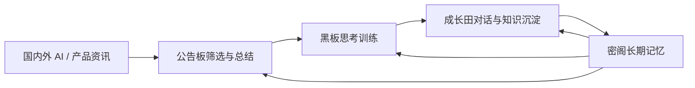
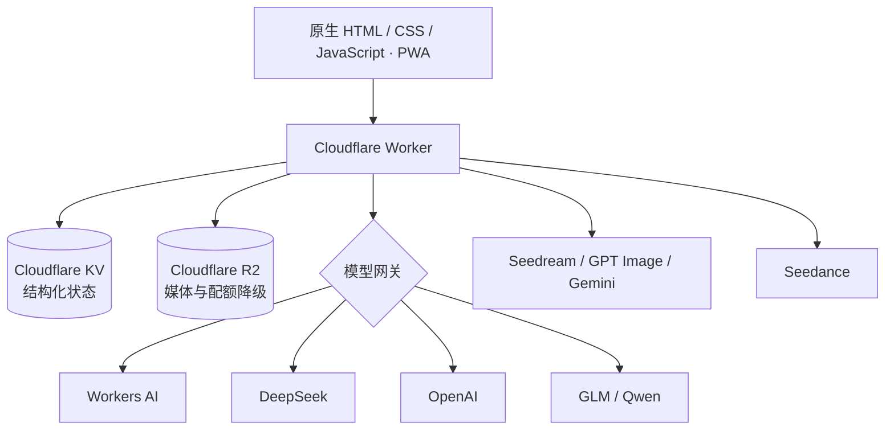

<div align="center">
  
  <h1>阿栗 · AI 个人成长助手</h1>
  <p><strong>把资讯、思考、对话与长期记忆连接成一个持续成长的闭环。</strong></p>
  <p>
    <a href="https://demo.neuralnode.top">在线演示</a> ·
    <a href="https://labixy1.github.io/chestnut-courtyard/">产品与技术文档</a> ·
    <a href="https://labixy1.github.io/chestnut-courtyard/07-测试与运维手册.html">测试与运维</a>
  </p>
</div>

> 这是一个由产品经理通过持续自然语言对话驱动 Codex，从需求定义、交互设计到开发、测试和云端部署完成的 AI 原生个人项目。仓库只包含程序、公开素材和演示数据，不包含真实树洞、记忆、照片、口令或 API Key。

## 为什么做阿栗

普通 AI 对话很容易停在“一问一答”：资讯看过就忘，思考没有反馈，长期对话也难以形成可靠积累。阿栗尝试把四件事接起来：

1. **公告板**获取并筛选国内外 AI 与产品资讯，保留来源、中文摘要、AI 判断和阅读笔记。
2. **黑板**把值得思考的问题转成每日训练，由独立评分基准完成批改、示范和下一步练习。
3. **成长田**通过多轮学习对话解释概念、比较方案、梳理困惑，并沉淀为可复习的知识专题。
4. **密阁记忆**把经过确认或重复验证的信息整理为带依据、边界和适用范围的长期记忆。



## 手机端体验

以下画面来自隔离的公开演示环境，内容均为虚构示例数据。

<table>
  <tr>
    <td align="center"><br><b>空间化首页</b><br><sub>用房间组织不同任务与心境</sub></td>
    <td align="center"><br><b>公告板</b><br><sub>资讯、AI 总结与产品判断</sub></td>
    <td align="center"><br><b>黑板</b><br><sub>每日训练、批改与示范回答</sub></td>
    <td align="center"><br><b>成长田</b><br><sub>多轮解惑并沉淀知识专题</sub></td>
  </tr>
</table>

## 产品亮点

### 1. 不只回答，而是形成成长闭环

资讯不是终点。公告板中的重要主题可以进入黑板训练，答题暴露的知识缺口可以回到成长田继续追问，稳定的学习方式和知识关注再进入密阁，反过来影响后续选题与讲解方式。

### 2. 先有评分基准，再看用户答案

黑板会先冻结参考答案、评分点和题型重点，再对用户答案进行诊断，避免被用户表述带偏。结果不只给分，还包含：答得好的地方、方向偏差、可操作的改进方式、大白话记忆提示和阿栗示范答案。

### 3. 有边界的长期记忆

记忆分为原始证据、候选卡片、生效卡片、综合档案和封存内容。单次行为不会直接上升为人格判断；树洞原文与普通学习记忆隔离；AI 每两天 04:00 对生效卡片进行综合整理，输出必须引用有效卡片 ID，失败则保留旧档案，并支持快照撤销。

### 4. 面向真实失败设计兜底

- 文本模型支持 Workers AI、DeepSeek、OpenAI、GLM、Qwen，并可按任务配置回退顺序。
- 异步任务在切页或刷新后继续恢复状态，避免按钮重置后重复提交。
- Cloudflare KV 写入超额时，关键任务和状态自动降级到 R2。
- 图片、视频和手动上传媒体统一进入私有 R2，并使用容量上限和省空间画质。
- 资讯采用多来源独立抓取，一个来源失败不会阻断整次巡报。

### 5. 用 Codex 构建产品，而不是只生成代码

项目采用“提出真实问题 → 明确验收标准 → Codex 实现 → 公网手机端测试 → 根据反馈继续迭代”的协作方式。产品决策、隐私边界和最终验收由人负责，Codex承担代码实现、测试、部署与文档同步。

## 功能地图

| 模块 | 核心能力 |
| --- | --- |
| 公告板 | 多源资讯、中文摘要、AI 总结、产品经理关注点、笔记、稍后看与归档 |
| 黑板 | 每日一题、分类轮换、独立评分基准、AI 批改、示范答案、历史与星标 |
| 成长田 | 多轮学习对话、成长种子、专题本、知识沉淀和复习线索 |
| 密阁 | 证据卡片、候选确认、分类管理、定时蒸馏、隐私隔离与撤销 |
| 树洞 | 文字/语音倾诉、陪伴式回复、草堆历史与记忆影像生成 |
| 旅行/照片墙 | 旅行记录、感悟总结、相册管理和 R2 媒体同步 |
| 工具箱/管家 | AI 工具管理、网页解析、任务执行、状态追踪和 Skill 展示 |

## 技术架构



前端保持无框架、无构建依赖；云端由 Worker 提供同源 API、口令会话、状态同步和模型路由。本地模式可由 Python 服务运行，`file://` 模式仍可浏览静态内容。

## 快速运行

### 只看界面

直接双击 `index.html`。静态内容可以浏览，AI、上传和跨设备同步需要本地服务或 Cloudflare Worker。

### 本地完整模式

```bash
cp .env.example .env
# 在 .env 中至少配置一个文本模型密钥
python3 scripts/cozy_server.py --port 8766
```

打开 `http://127.0.0.1:8766/`。项目不要求安装 npm、前端框架、数据库或 Docker。

### Cloudflare 部署

```bash
python3 scripts/build_cloud.py --mode owner
python3 scripts/cloud_owner_test.py
node scripts/cloud_worker_test.mjs

cd cloudflare
wrangler deploy --config wrangler.toml
```

口令、会话密钥与模型密钥必须通过 Cloudflare Secret 管理，不能提交到仓库。完整步骤见 [测试与运维手册](https://labixy1.github.io/chestnut-courtyard/07-测试与运维手册.html)。

## 数据与隐私

- GitHub 只保存程序、公开素材、内置 Skill 和 `core/defaults/instance_seed.json`。
- 真实巡报、树洞、记忆、照片、旅行、任务、日志和实例私有 Skill 均被排除。
- 主人版和演示版使用隔离的数据空间；公开构建只读取演示种子。
- 新克隆的仓库首次启动时会从公开种子创建空白私人实例，不连接原作者数据。
- 彻底忘记会保留 tombstone，防止旧设备同步时把已删除记忆重新写回。

发布前建议运行：

```bash
python3 scripts/privacy_scan.py
python3 scripts/repository_readiness_test.py
python3 scripts/cloud_privacy_test.py
python3 scripts/cloud_owner_test.py
node scripts/cloud_worker_test.mjs
```

## 进一步阅读

- [文档总览](https://labixy1.github.io/chestnut-courtyard/)
- [AI 与接口调用链](https://labixy1.github.io/chestnut-courtyard/06-AI与接口调用链.html)
- [测试与运维手册](https://labixy1.github.io/chestnut-courtyard/07-测试与运维手册.html)
- [Cloudflare 部署说明](cloudflare/README.md)

## 项目状态

阿栗仍在持续迭代。当前重点是提高资讯筛选与教学质量、让记忆更可核验，并继续完善移动端异步任务与跨设备同步体验。
