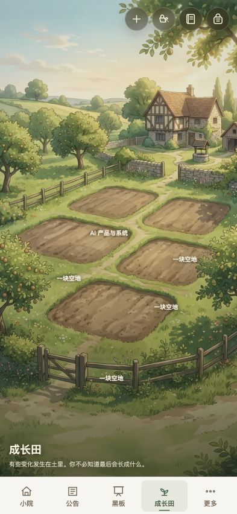

# 使用指南

## 登录与同步

1. 打开私人域名，输入小院口令；眼睛按钮用于显示或隐藏口令。
2. 登录会话有效期 7 天。连续输错 50 次后，同一网络地址锁定 15 分钟。
3. 页面左上角显示阿栗在线状态。结构化数据会在打开页面、修改后和每 60 秒自动同步。
4. 手机与电脑使用同一私人域名和同一账号时，共享云端结构化数据。

注意：当前未启用 R2。旅行或照片墙新上传的本机图片，不保证在另一台设备永久可见；文字、专题、答案、记忆和列表可以同步。

## 首页

- 桌面：点击场景上的文字进入对应空间。
- 手机：底部依次是小院、公告、黑板、成长田、更多。
- 天气图不对时先刷新；天气接口两小时内使用缓存，失败时保留最近一次有效天气。
- “保存到主屏幕”会显示 iPhone Safari 的添加步骤。

## 公告板

1. “获取最新资讯”会启动一次真实更新，并显示运行、成功或失败状态。
2. “最新巡报”阅读本期内容；“往期巡报”查看实际保存的历史版本。
3. 每篇资讯可查看原文、复制原链、稍后看、收入栗夹或加入工具箱。
4. 展开“阅读笔记”记录重点；再次打开仍可编辑或删除。
5. “给阿栗留言”可指定下次关注方向、来源或分类。相同内容不会重复归档。

更新规则：每周一、周三、周五 08:00 自动检查。没有新内容时不新增版本；来源临时不可用时保留最近巡报并提示稍后重试，没有任何历史缓存时才报错。

## 黑板

1. 先阅读题目和本题资料，也可在“题边的阿栗”中只问背景概念。
2. 写完答案后提交，AI 逐项给分并生成“阿栗帮答”、标准答案、修改建议和下一步练习。
3. 评分明显不合理时使用“重新核分”。系统会要求每项引用原答案证据。
4. 星形按钮可收藏题目；历史题目中使用“★ 星标”筛选。
5. 历史详情可按第 1、2、3 次作答切换，也可再次作答。
6. “以后想练什么”只作为出题参考，不会把每个方向单独建成分类。

## 成长田

- “开始解惑”：开启多轮问答。旧会话保留在左侧，可收起；聊天按时间显示。
- “专题本”：查看自动整理的概念、对象特点、对比表、场景、复习要点和结论。
- 空地：只显示该地的知识专题空状态，不跳到聊天。
- 有植物的地：显示阶段、养分来源、浇水记录，可单独浇水或在成熟后摘取。
- “批量照料”：一键浇水或一键收成；当天浇过的土地不会重复浇水。
- “背包”：收成以果实卡片呈现；摘取后土地恢复为空地，可长出其他专题。

生长来自有效问答、黑板思考、旅行感悟等内容，速度有上限，不会因普通闲聊快速成熟。

## 树洞

- 签语适合短内容；对话适合继续梳理。
- 每条签语、对话和草堆影像都支持编辑或删除。
- 删除会写入遗忘标记，防止旧设备把记录重新同步回来。
- 树洞原文属于封存数据，不会进入普通阿栗回答。

## 旅行

- 手机用三个独立标签：旅行记录、记旅程、写感悟。
- 新建时填写地点和日期；日期留空不会显示无意义的年月日占位。
- 每段旅行保留两三张代表照片，可编辑内容或删除记录。
- 保存感悟后输入框和选中旅行会清空；摘要会替换默认提示语。

## 照片集

- “小院的所有照片”只收录小院、公告、树洞、照片墙、卧室、成长田和旅行等背景图，不包含密阁。
- 该系统合集不可删除图片；普通相册可移动、删除或整组删除。
- 图片使用 `contain` 完整显示，不按格子比例强行裁切。

## 密阁与阿栗

- 密阁展示可读档案、长期记忆、证据分类和系统能力。
- “忘记”会同时删除卡片与关联证据，并保留防复活标记。
- 阿栗只能对已注册工具执行操作。无法完成系统修改时会明确显示“无法执行”，不会一直转圈。
- 语音输入优先使用浏览器识别；不支持时上传录音转写。首次使用需要允许麦克风。

## 演示版

- 一键重置：恢复独立演示空间。
- 引导示例：加载不含私人信息的示例。
- 激活阿栗：主人输入演示管理口令后临时开启 AI，也可立即关闭。
