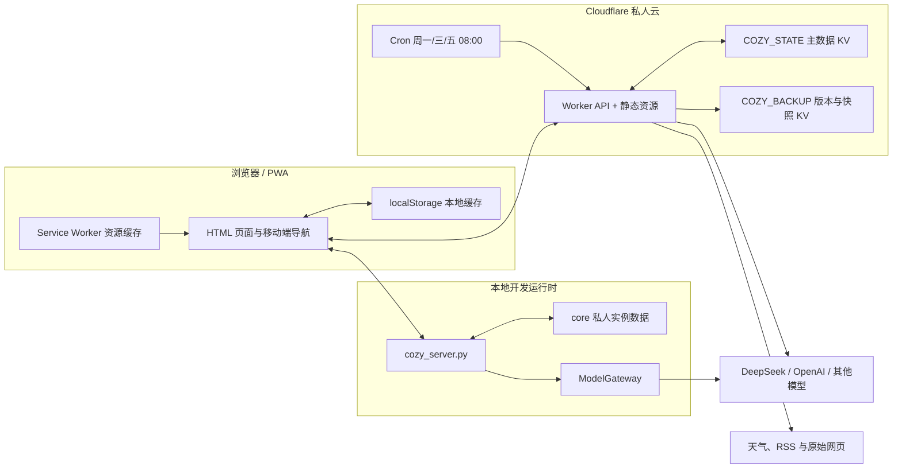
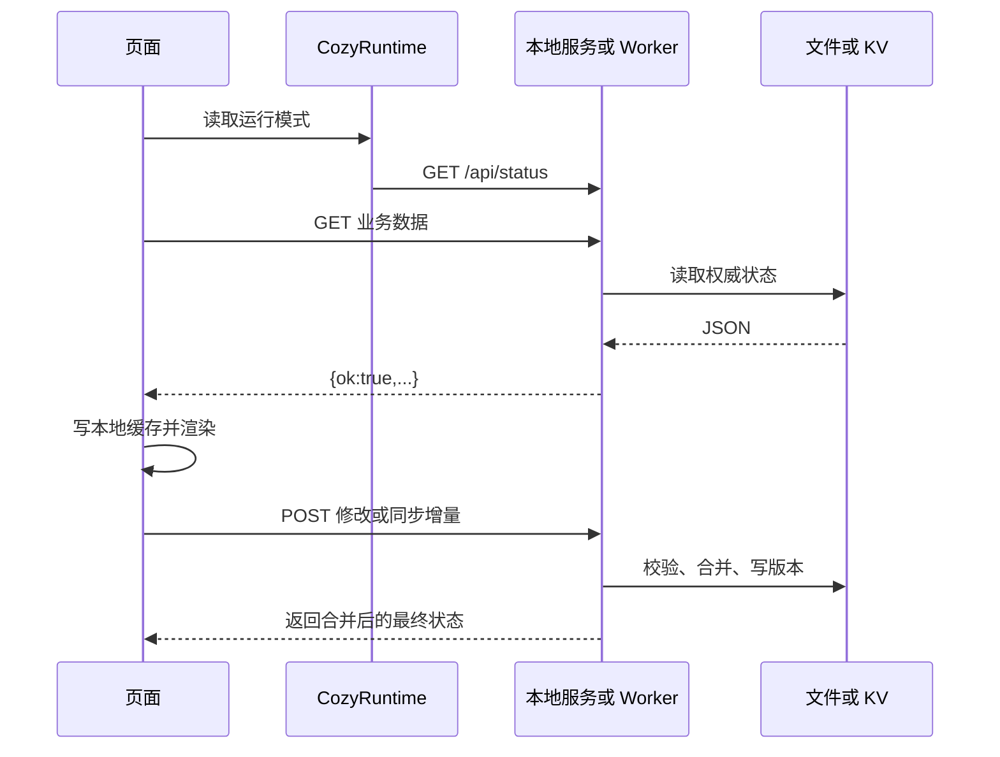
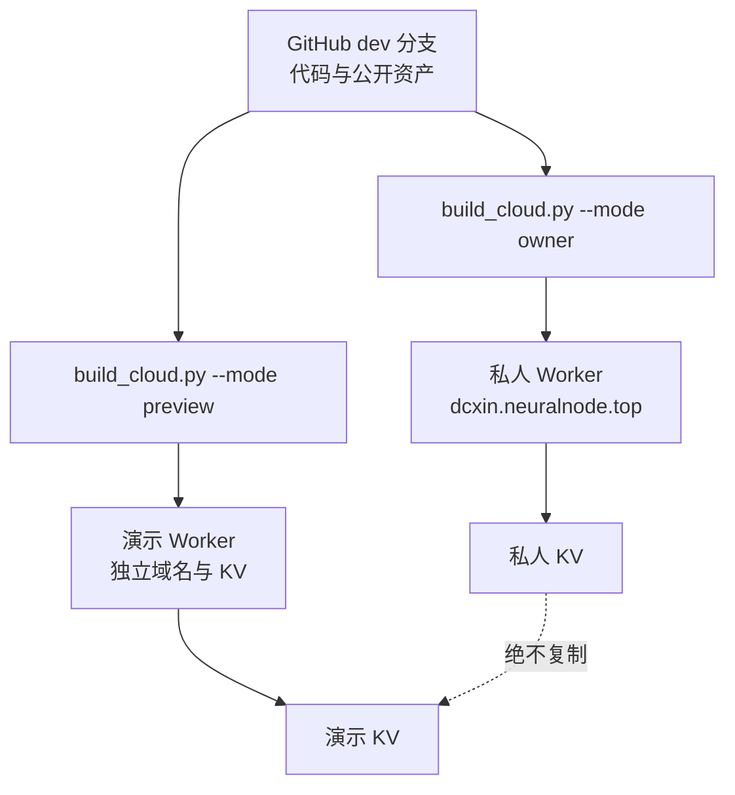

# 系统架构

## 1. 总体结构


同一套前端有三种运行模式：

| 模式 | 入口 | 数据源 | 用途 |
| --- | --- | --- | --- |
| `dev` | `127.0.0.1:8766` | 本地 `core/` + 本地 API | 开发与完整本机功能 |
| `owner` | 私人域名 | 私人 Worker + `COZY_STATE` | 主人日常使用 |
| `interview` | 演示域名 | 独立 Worker + 独立 KV | 面试展示，不接触主人数据 |

## 2. 目录职责

```text
cozy-estate/
├── index.html                 首页、公告、黑板、工具箱、照片集
├── pages/                     树洞、成长田、旅行、卧室、密阁
├── core/                      前端运行时、初始数据、Skills、私人本地状态
├── assets/                    公共背景、图标与本机上传目录
├── scripts/                   本地服务、AI、记忆、构建、同步与测试
├── cloudflare/                Worker、KV 状态层与部署配置
├── docs/                      产品、技术、测试与运维文档
├── dist/                      演示构建，Git 忽略
└── dist-owner/                私人云构建，Git 忽略
```

## 3. 请求路径



本地和云端尽量使用相同 API 契约。云端没有本机进程权限，因此系统修改、原生语音和本机文件操作会受限；前端必须显示真实能力状态。

## 4. PWA 与资源加载

- `manifest.webmanifest` 定义应用名“阿栗”、狗头图标和 standalone 模式。
- `sw.js` 预缓存最小页面外壳；大背景图第一次使用时再缓存，避免首次安装加载全部天气图片。
- 页面加载使用桌面和移动两套压缩 WebP；天气确定前保留遮罩，防止默认晴天图闪现。
- Service Worker 更新使用 `updateViaCache: none`，新版本激活后提示刷新。

## 5. Cloudflare 组件

| 组件 | 绑定 | 职责 |
| --- | --- | --- |
| 主数据 KV | `COZY_STATE` | 结构化业务数据、记忆、会话、任务和认证限流 |
| 备份 KV | `COZY_BACKUP` | 每次关键写入的旧版本、手动与定时全量快照 |
| Workers AI | `AI` | 外部文本模型都不可用时的最后文本兜底 |
| 私人媒体 R2 | `COZY_MEDIA` | 永久保存主人版生成媒体及照片墙、旅行、树洞的手动上传照片；9GB 应用软上限 |
| 静态资源 | `ASSETS` | 提供 `dist-owner/` 或 `dist/` |
| Cron | `0 0 * * 1,3,5` | UTC 00:00，即上海时间周一、三、五 08:00 |

主人版已绑定私有 R2 bucket `chestnut-courtyard-media`。生成媒体和手动上传照片都通过登录后的 `/api/media/file` 私有读取；bucket 未开放 `r2.dev` 公网访问，演示版也不绑定该 bucket。`COZY_PRIVATE` 仍未绑定，结构化全量备份继续使用 `COZY_BACKUP` KV。

## 6. 发布拓扑


