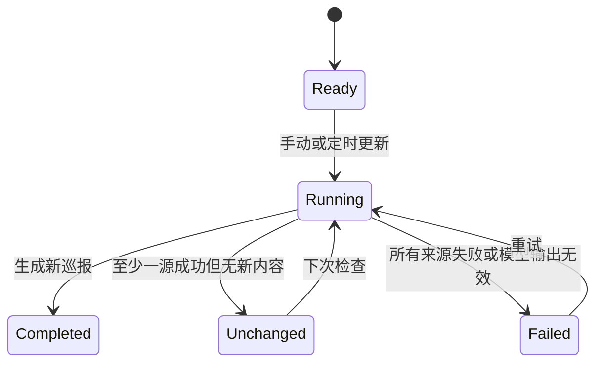
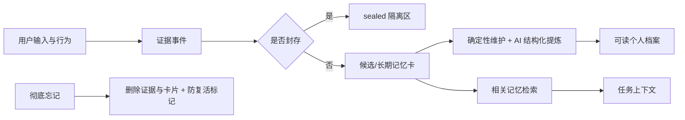

# 模块与功能规格

## 1. 模块清单

| 模块 | 入口 | 主要输入 | 主要输出 | 持久化 |
| --- | --- | --- | --- | --- |
| 首页 | `index.html` | 天气、场景点击 | 导航、在线状态 | 天气缓存 |
| 公告板 | 首页弹层 | 更新、留言、阅读动作 | 巡报、笔记、工具卡 | KV 报告与本地状态 |
| 黑板 | 首页弹层 | 答案、追问、星标 | 评分、标准答案、历史 | KV 题目与本地状态 |
| 工具箱 | 首页弹层 | 分类、链接导入 | 工具卡、公开 Skills | `butler_state` + 本地状态 |
| 照片集 | 手机更多 | 图片、相册操作 | 系统合集、普通相册 | 本地状态；媒体有限制 |
| 成长田 | `pages/orchard.html` | 多轮问题、浇水、收成 | 专题、植物阶段、背包 | 本地状态同步 KV |
| 树洞 | `pages/heart_hollow.html` | 倾诉、影像、编辑删除 | 签语、对话、草堆 | 封存数据 + 删除标记 |
| 旅行 | `pages/travel.html` | 地点、日期、照片、感悟 | 旅行卡、摘要 | 本地状态同步 KV |
| 卧室 | `pages/bedroom.html` | 开灯/关灯 | 日夜背景 | 轻量界面状态 |
| 密阁 | `pages/memory_nook.html` | 分类、遗忘、维护操作 | 档案、证据、Skills | 记忆主数据 |
| 阿栗 | 全局抽屉 | 文本或语音指令 | 回复、工具结果、任务状态 | 对话历史、任务与记忆 |

## 2. 首页与天气

天气服务输出 `condition`、温度、昼夜、场景和更新时间。前端按 `sunny`、`morning`、`overcast`、`rain`、`thunder`、`fog`、`snow` 选择桌面或手机图片。接口失败时优先使用未过期缓存，再使用明确标注的兜底状态。

首页场景热点只负责导航，不直接写业务数据。手机不强行复用桌面热点坐标，使用底部导航完成主要操作。

## 3. 公告板

状态机：



去重同时使用规范化 URL 和标题。留言找到的内容在渲染前与上方所有区块再次去重。历史版数只统计实际 `reports`，不统计空白占位。

阅读笔记以资讯稳定键关联，可新增、编辑和删除。加入工具箱时，AI 生成结构化卡片，按来源 URL 幂等写入。

## 4. 黑板

题目包含标题、问题、题型、本题资料和标准要点。一次作答保存原答案、时间、四维评分、诊断、阿栗帮答、标准答案、建议、下一题与参考答案。

评分固定四维，每项 25 分：问题理解、方案完整、验证与指标、风险与回滚。评分器必须引用原答案；通用假设题不能要求题目未提供的具体产品信息。非空答案被错误打 0 分时自动重试一次，仍无依据则返回失败。

历史题目按稳定主题聚类，不按每道题创建分类。每题保存多次 attempts，用户可切换序号、重新作答、星标和筛选。

## 5. 成长田

知识专题和聊天是两个界面。聊天会话包含稳定 ID、标题、消息列表、创建与更新时间；消息时间间隔超过 5 分钟或跨日期时显示时间分隔。

专题结构：

```json
{
  "title": "AI 编程工具与 Harness 框架",
  "category": "AI 技术与产品",
  "entities": ["Cursor", "Claude Code"],
  "summary": "可复习摘要",
  "knowledgePoints": ["事实或判断"],
  "comparisonRows": [{"item": "对象", "traits": "特点", "scenarios": "场景", "considerations": "限制"}],
  "scenarios": ["应用场景"],
  "conclusion": "当前结论",
  "entries": [{"question": "原问题", "answer": "回答"}]
}
```

五块地由专题占用。有效内容提供有限养分，阶段在多个阈值间随机呈现；单日浇水幂等。成熟后收成写入背包，再将土地恢复为空地。空地详情只显示专题空状态。

## 6. 树洞与封存

签语模式返回一句短签语；对话模式返回具体回应。只有足够具体、可持续的成长线索才进入普通成长事件，树洞原文和封存影像不进入全局回答上下文。

删除记录时同时更新内容列表和 tombstone。编辑保持原记录 ID，更新时间推进，从而参与跨设备冲突决胜。

## 7. 旅行与照片

旅行对象包含 `id`、地点、开始/结束日期、状态、照片、摘要和 `updatedAt`。感悟按旅行键保存，AI 只做忠实摘要，不伪造经历。手机三个视图互斥显示，避免表单和记录同时挤压。

照片卡固定尺寸，图片使用 `object-fit: contain`。系统背景合集只读；普通相册允许增删排序。没有 R2 时，上传媒体不能承诺跨设备永久保存。

## 8. 记忆系统



AI 提炼只能提交结构化建议，必须经过 ID、证据阈值、封存边界和原子写入校验。失败时保留原数据和审计记录，可回滚。

## 9. 系统 Skills 与工具

密阁展示 `System Skills · 系统骨架` 和 `Callable Tools · 查看全部 30 项可调用能力`。Skill 标题中英并列，描述使用中文。系统内置图像素材生成和 OpenCV 智能抠图，但 Seedream 生图入口目前不作为成长田默认流程。

阿栗执行工具时保存工具名、结果、摘要和时间。只有 `ok=true` 才显示完成；系统修改需要具备权限、生成快照并通过验证，否则直接显示无法执行。
