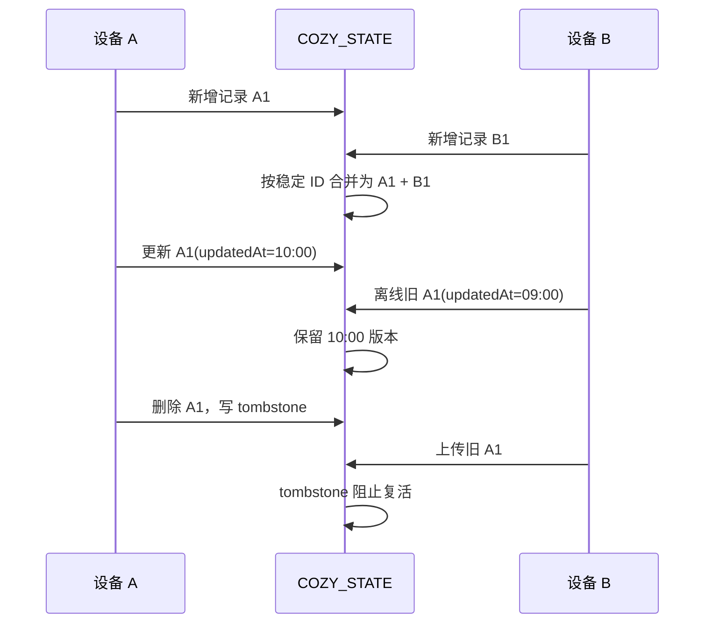

# 数据同步与安全

## 1. 数据在哪里

| 数据 | 私人云 | 本机 | GitHub | 演示版 |
| --- | --- | --- | --- | --- |
| 旅行文字、答案、专题、列表 | `COZY_STATE` KV 主数据 | localStorage 缓存 + `core/local_state.json` | 不保存 | 独立示例 |
| 普通记忆与档案 | KV 记忆键 | `core/memory/` | 不保存 | 空白/示例 |
| 树洞封存内容 | KV `memory:sealed` 等 | 私人实例文件 | 不保存 | 不提供 |
| API Key 与口令 | Worker Secret | `.env` / `.dev.vars` | 不保存 | 独立 Secret |
| 公共背景与图标 | 静态 Worker | `assets/` | 保存 | 共用公开资产 |
| 新上传媒体 | 当前无 R2 保证 | `assets/*/uploads/` | 不保存 | 不提供私人上传 |
| 备份 | `COZY_BACKUP` KV | 手动导出到临时文件 | 不保存 | 独立 KV |

结论：结构化数据已经以云端为主，可在手机和电脑间同步。新增媒体文件仍是当前最明显的缺口；没有启用 R2 前，不能把本机上传照片描述为永久跨设备保存。

## 2. 同步协议

浏览器维护一个不上传的轻量同步账本 `cozy_sync_shadow_v2`，只记录每个字段和记录的摘要。它不复制正文，用于判断本机发生了哪些新增、修改和删除。



### 合并规则

1. 数组按 `id`、`key`、URL、题目 ID 或日期标题组合确定稳定记录。
2. 两台设备新增不同 ID 时取并集。
3. 同 ID 都更新时，优先 `updatedAt` / `updated_at` 较新的版本。
4. 删除写入 tombstone；时间早于删除的离线副本不能复活。
5. 主人在已同步删除后明确重新创建同一 ID 时，客户端发送 `revive` 标记，允许真正重建；普通旧副本没有该标记。
6. 对象映射按属性键执行同样的增量合并。
7. 没有同步账本的首次连接以已初始化云端为准，避免旧电脑覆盖云端。
8. 老客户端的整字段写入接口仍兼容，但新客户端统一使用增量协议。

Cloudflare KV 属于最终一致存储。同步算法解决应用层并发覆盖，但极短时间内不同边缘节点可能暂时读到旧值；下一次 60 秒同步会收敛。

## 3. 云端键空间

业务数据使用 `data:<name>`：

- `data:local_state`：浏览器结构化状态和 tombstones。
- `data:estate_state`：等级、旅行基础状态等。
- `data:notice_reports`、`data:daily_questions`：巡报与题目。
- `data:butler_state`：工具箱、关注方向、来源、任务摘要。
- `data:permissions`、`data:automation_state`、`data:weather_cache` 等运行状态。

记忆使用独立键：`memory:events`、`memory:sealed`、`memory:profile`、`memory:categories`、`memory:overrides`、`memory:distillation`。

每个 `writeData` 会增加 `data-meta:<name>` revision，并在 `COZY_BACKUP` 写入旧版本。全量备份位于 `full-snapshots/<reason>/<timestamp>.json`。

## 4. 认证与权限

- 私人 Worker 默认 `AUTH_MODE=passcode`，口令和 `SESSION_SECRET` 只存 Worker Secret。
- 会话 Cookie 为 HttpOnly、Secure、SameSite=Strict，有效期 7 天。
- 同一 IP 连续错误 50 次后锁定 15 分钟；成功登录会清零错误计数。
- 静态业务资产也受认证保护，只有应用图标允许登录页读取。
- 同步导入使用独立 `SYNC_SECRET`，并比较 HMAC，不在命令行或仓库明文保存。
- 演示 AI 使用 `DEMO_ADMIN_PASSCODE`，激活有到期时间，不复用主人口令。

## 5. 隐私边界

构建脚本从 `core/defaults/instance_seed.json` 生成空白云包，不复制私人实例 JSON。隐私测试会检查：

- 旅行、照片墙、树洞和封存记忆为空。
- `core/local_state.json`、记忆目录、任务、审计、权限、上传与生成目录不存在。
- `.env`、`.dev.vars`、`dist-owner/` 和上传目录均被 Git 忽略。
- 公开演示 Worker 使用独立 KV，不可读取私人 KV。

## 6. 备份与恢复

优先使用 HTTPS API：

```bash
python3 scripts/cloud_sync.py status
python3 scripts/cloud_sync.py backup
python3 scripts/cloud_sync.py pull
```

公司网络拦截 Python TLS 时，使用 Wrangler 直连 KV，不关闭证书校验：

```bash
python3 scripts/cloud_sync.py status --transport wrangler
python3 scripts/cloud_sync.py backup --transport wrangler
python3 scripts/cloud_sync.py pull --transport wrangler
```

覆盖云端是高风险操作，必须显式确认；Wrangler 模式会先创建 `before-import` 全量备份：

```bash
python3 scripts/cloud_sync.py push --transport wrangler --confirm-cloud-overwrite
```

恢复前应保留当前快照，不要直接用旧电脑的 `core/` 覆盖云端。

## 7. 当前限制与建议

| 限制 | 影响 | 建议 |
| --- | --- | --- |
| 未启用 R2 | 新上传图片不能保证跨设备永久保存 | 具备可用支付方式后创建私有 R2 并绑定 `COZY_MEDIA`、`COZY_PRIVATE` |
| KV 最终一致 | 极短时间可能读到旧状态 | 保持增量同步和 revision；重要写入后显示保存状态 |
| 浏览器语音差异 | Safari/Chrome 权限和支持不同 | 保留浏览器识别与录音转写双通道 |
| 外部模型和资讯源不稳定 | AI 或巡报可能失败 | 显示真实失败，保留重试和主备模型 |
