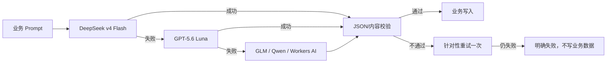
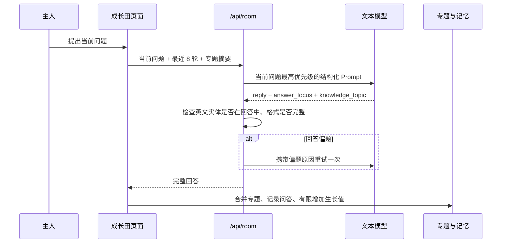
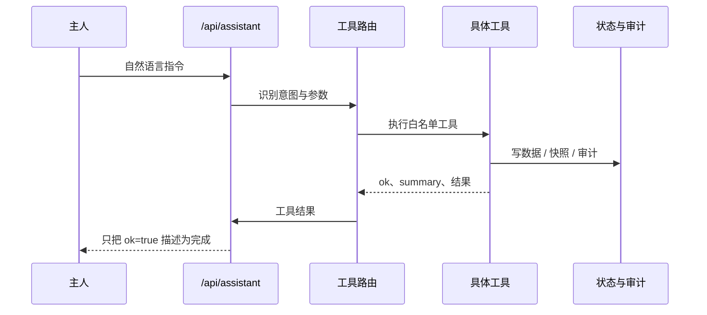

# AI 与接口调用链

## 1. 文本模型路由

当前私人云配置：

1. 主模型：DeepSeek `deepseek-v4-flash`。
2. 备用模型：OpenAI `gpt-5.6-luna`。
3. 若另外配置 GLM、Qwen 或 Workers AI，可在前两者失败后继续兜底。

路由只尝试已配置 API Key 的模型。每次失败被记录在本次调用中；所有模型失败时返回合并后的明确错误，不伪造答案。

`gpt-5.6-luna` 在本项目中只作为文本模型调用。图片生成使用独立的 GPT Image、Gemini Nano Banana 或 Seedream 接口，不能因为文本模型名称推断其具备读图或生图能力。

## 2. 成长田问答

成长田回答阶段不注入无关的全局记忆，避免旧题、公告或其他房间内容盖过当前问题。已有专题只用于指代消解和答完后的归档。

## 3. 黑板调用

### 出题

输入包含日期、近期题型、用户“以后想练什么”、近期巡报和非封存记忆。输出必须有问题、题型、最多两条资料和 4 至 6 个标准要点。同日换题使用独立 variant 缓存键。

### 题边小助手

只补当前题目的背景概念，返回 `reply` 和一条可独立阅读的附属资料。它不能提前泄露标准答案或替用户完成方案。

### 评分

模型返回四维评分、证据理由、诊断、阿栗帮答、标准答案和后续练习。后端重新计算总分，不信任模型自报总分。非空答案被无依据打 0 分时自动重试；仍失败则不覆盖旧评分。

## 4. 公告更新

1. 根据固定来源、产品主题和主人关注方向构造查询。
2. 并发抓取 RSS；所有来源失败时抛出失败。
3. 规范化 URL 和标题，与全部历史巡报去重。
4. 无新候选时记录 `unchanged=true`，不新增版本。
5. 模型从候选中挑选 7 至 11 条并生成忠实摘要、判断与建议。
6. 校验 `source_id` 必须来自候选，再写入新巡报。

“主人关注”只有候选确实匹配时才生成。留言找到的内容与本期其他区块再次去重。

## 5. 阿栗工具调用

系统修改类工具需要掌院权限，先创建快照，再限制修改文件和行数，运行验证后才提交。超时、权限不足、验证失败或工具不存在都显示“无法执行”。

## 6. 记忆调用

- 输入先生成 evidence event，再由规则判断工作记忆、长期候选或封存。
- 回答检索只返回与当前任务相关的非封存卡片。
- AI 提炼输出结构化 proposal；确定性代码校验证据数量、卡片 ID、冲突关系和封存边界。
- proposal 原子应用，失败不部分写入；每次运行保存 before/after 摘要与回滚记录。

## 7. 主要 API

| 路径 | 方法 | 功能 |
| --- | --- | --- |
| `/api/status` | GET | 运行模式、权限、存储和演示激活状态 |
| `/api/local-state` | GET/POST | 读取或增量合并浏览器结构化状态 |
| `/api/state/sync` | POST | 工具箱与管家状态同步 |
| `/api/assistant` | POST | 全局阿栗回答与工具执行 |
| `/api/room` | POST | 成长田、黑板、树洞、旅行的结构化 AI |
| `/api/blackboard/today` | GET | 获取或生成每日题目 |
| `/api/weekly/run` | POST | 启动资讯更新任务 |
| `/api/automation` | GET | 自动化运行状态 |
| `/api/memory*` | GET/POST | 记忆、事件、动作、提炼与状态 |
| `/api/media*` | GET/POST | 上传、生成和任务查询；云端媒体受 R2 限制 |
| `/api/sync/export` | GET | 导出完整私人结构化快照 |
| `/api/sync/import` | POST | 高权限导入云端快照 |
| `/api/backup/run` | POST | 创建全量备份 |
