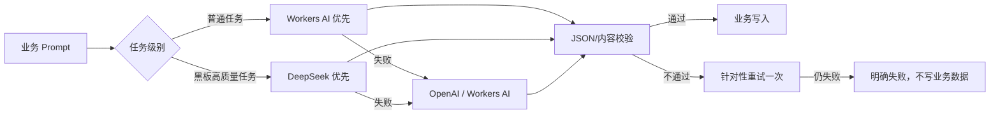
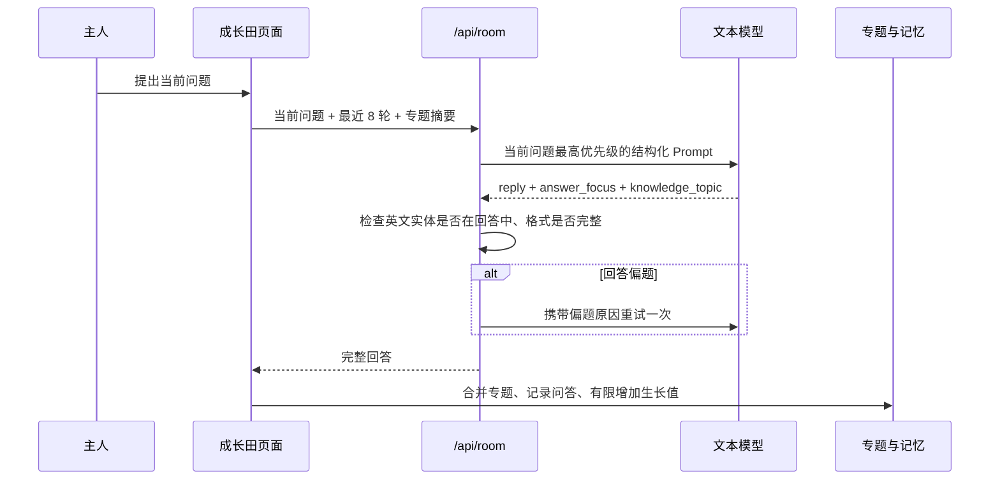
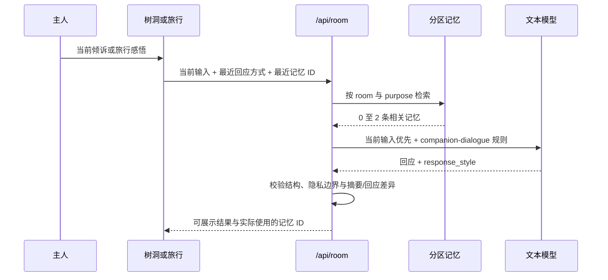
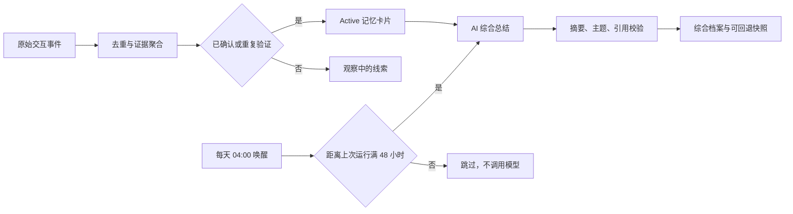
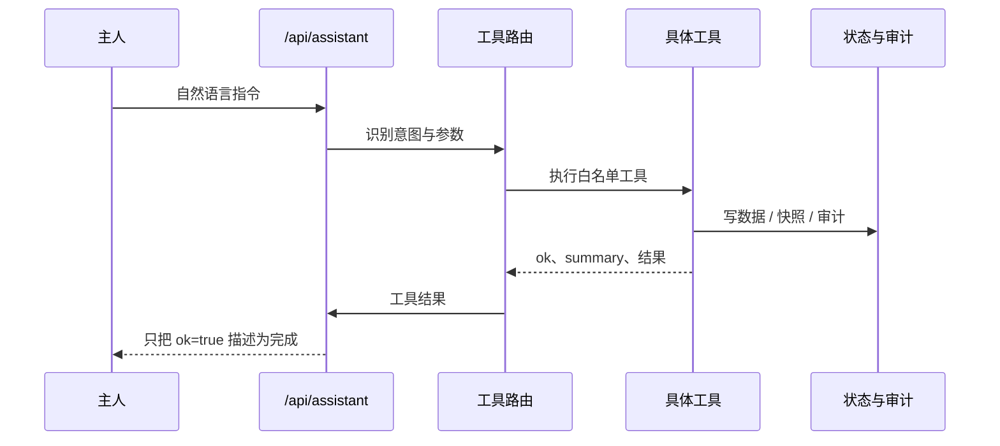

# AI 与接口调用链

## 1. 文本模型路由

当前私人云采用分级路由：

1. 普通任务优先 Cloudflare Workers AI `@cf/meta/llama-3.1-8b-instruct-fp8`，主要覆盖普通问答、翻译、摘要、树洞和旅行陪伴，优先使用 Cloudflare 套餐内额度以降低费用。
2. 黑板参考答案、正式批改和重新核分优先 DeepSeek `deepseek-v4-flash`，继续执行分阶段评分、教学补全和质量校验。
3. 首选模型失败时，按当前任务允许的模型顺序自动兜底；OpenAI、GLM、Qwen 只有在配置可用密钥后才会参与。

路由只尝试已配置且可用的模型。每次失败被记录在本次调用中；所有模型失败时返回合并后的明确错误，不伪造答案。Workers AI 并非无限免费，实际费用与免费额度以 Cloudflare 账号套餐为准。

`gpt-5.6-luna` 在本项目中只作为文本模型调用。图片生成使用独立的 GPT Image、Gemini Nano Banana 或 Seedream 接口，不能因为文本模型名称推断其具备读图或生图能力。

## 2. 成长田问答

成长田回答阶段不注入无关的全局记忆，避免旧题、公告或其他房间内容盖过当前问题。已有专题只用于指代消解和答完后的归档。

## 3. 树洞与旅行陪伴

树洞使用 `heart_companion`：最多一条明确陪伴偏好；只有当前输入包含连续性表达时，才可再加入一条去隐私趋势。树洞原文不离开 `heart_only` 封存区。回答在 `listen`、`clarify`、`reframe`、`suggest`、`lighten`、`challenge` 中选择，并避开前两轮已用方式。

旅行使用 `travel_companion`：最多一条陪伴偏好和一条与当前 `trip_id` 相同的已保存感悟。AI 返回的 `summary` 与 `reply` 职责分开，前者只归档用户原意，后者才进行陪伴。预览请求携带 `commit=false`，不写记忆；“保存感悟”携带 `commit=true` 和稳定事件 ID，成功后写 `travel_only`。失败时保存忠实本地摘要，不伪造模型回应。

普通管家使用 `butler/general`：默认只读取学习与沟通偏好，不读取树洞；只有用户明确询问自己的旅行时才检索相关旅行事件。所有陪伴场景都允许零记忆，当前输入永远高于历史记忆。

## 4. 记忆整理与自动更新

密阁把“原始事件、记忆卡片、综合档案”分成三层：原始事件保留依据；只有主人确认或多次重复验证的卡片进入 active；AI 每两天 04:00 将 active 卡片重新综合为一段总摘要和 2 至 5 个主题结论。树洞原文处于 sealed 区，不会送入这次普通档案整理。

Cloudflare Cron 每天 04:00 唤醒 Worker，Worker 检查距 `last_auto_success` 是否已满 48 小时；未到期立即跳过，到期后才调用模型。手动整理不会改变自动节奏。整理优先 DeepSeek，失败时按已配置模型回退。写入前校验总摘要长度、主题数量及每个主题引用的 `source_card_ids`；不合格时保留旧档案。每次成功前保存 90 天快照，可在密阁撤销上一次整理。

## 5. 黑板调用

### 出题

输入包含日期、近期题型、用户“以后想练什么”、近期巡报和非封存记忆。输出必须有问题、题型、最多两条资料和 4 至 6 个标准要点。同日换题使用独立 variant 缓存键。

### 题边小助手

只补当前题目的背景概念，返回 `reply` 和一条可独立阅读的附属资料。它不能提前泄露标准答案或替用户完成方案。

### 评分

模型返回四维评分、证据理由、诊断、阿栗帮答、标准答案和后续练习。后端重新计算总分，不信任模型自报总分。非空答案被无依据打 0 分时自动重试；仍失败则不覆盖旧评分。

## 6. 公告更新

1. 根据固定来源、产品主题和主人关注方向构造查询。
2. 并发抓取 RSS；所有来源失败时抛出失败。
3. 规范化 URL 和标题，与全部历史巡报去重。
4. 无新候选时记录 `unchanged=true`，不新增版本。
5. 模型从候选中挑选 7 至 11 条并生成忠实摘要、判断与建议。
6. 校验 `source_id` 必须来自候选，再写入新巡报。

“主人关注”只有候选确实匹配时才生成。留言找到的内容与本期其他区块再次去重。

## 7. 阿栗工具调用

系统修改类工具需要掌院权限，先创建快照，再限制修改文件和行数，运行验证后才提交。超时、权限不足、验证失败或工具不存在都显示“无法执行”。

## 7. 记忆调用

- 输入先生成 evidence event，再由规则判断工作记忆、长期候选或封存。
- 回答检索先按 `learning_format`、`companion_style`、`heart_only`、`travel_only`、`topic_selection`、`review_only`、`record_only` 分区，再做相关性排序。
- 普通回答只返回当前任务允许的非封存卡片；树洞封存原文不能进入普通检索。
- 管家与陪伴对话每轮最多两条记忆，可返回零条；请求中的 `recent_memory_ids` 会阻止近期内容连续重复。
- `room_id` 把旅行记忆限制在对应旅程；只有明确询问旅行时，普通管家才可跨房间检索一条相关事件。
- AI 提炼输出结构化 proposal；确定性代码校验证据数量、卡片 ID、冲突关系和封存边界。
- proposal 原子应用，失败不部分写入；每次运行保存 before/after 摘要与回滚记录。

## 8. 主要 API

| 路径 | 方法 | 功能 |
| --- | --- | --- |
| `/api/status` | GET | 运行模式、权限、存储和演示激活状态 |
| `/api/local-state` | GET/POST | 读取或增量合并浏览器结构化状态 |
| `/api/state/sync` | POST | 工具箱与管家状态同步 |
| `/api/assistant` | POST | 全局阿栗回答与工具执行 |
| `/api/room` | POST | 成长田、黑板、树洞、旅行的结构化 AI |
| `/api/blackboard/today` | GET | 获取或生成每日题目 |
| `/api/weekly/run` | POST | 启动资讯更新任务 |
| `/api/automation` | GET | 自动化运行状态 |
| `/api/memory*` | GET/POST | 记忆、事件、动作、提炼与状态 |
| `/api/media*` | GET/POST | 上传、生成和任务查询；云端媒体受 R2 限制 |
| `/api/sync/export` | GET | 导出完整私人结构化快照 |
| `/api/sync/import` | POST | 高权限导入云端快照 |
| `/api/backup/run` | POST | 创建全量备份 |
