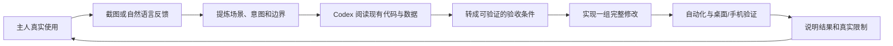
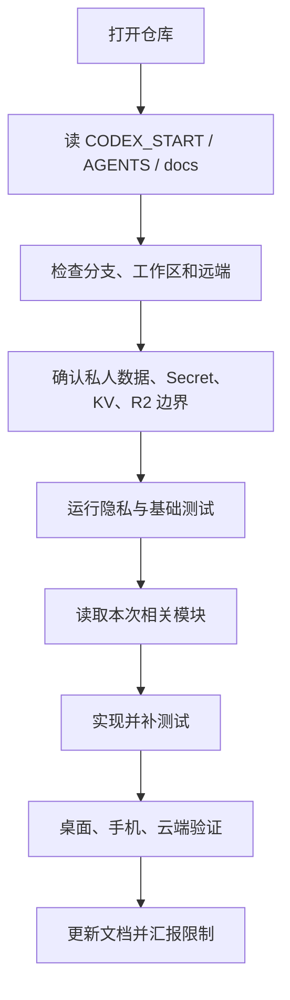

# Codex 协作与迁移指南

## 1. 为什么这份文档重要

阿栗不是先写完 PRD 再一次性交付的项目。它通过主人真实使用、截图指出问题、Codex 阅读代码并修改、主人再次体验的循环逐渐成形。

这段过程本身是一种产品方法：主人负责感受、取舍和场景判断，Codex 负责把模糊反馈转成实现、数据规则和测试。项目价值不仅在最终页面，也在于如何让人与 AI 围绕一个长期产品建立可靠的共同上下文。

Codex 账号、聊天记录和临时记忆都可能更换，因此不能把关键决策只留在对话里。可迁移的上下文必须落在仓库文档、代码、测试和云端状态中。

## 2. 项目是怎样通过对话构建的



典型反馈通常不是工程语言，例如：

- “这个界面太挤了。”背后可能是移动断点、信息层级、输入框字号和底部导航共同失衡。
- “阿栗没有执行完。”背后需要区分任务已创建、正在运行、执行成功、失败和前端状态丢失。
- “手机和电脑会同步吗？”背后需要定义权威源、并发合并、删除语义、离线恢复和媒体存储。
- “这道题给分不准确。”背后需要评分维度、0 分边界、重试规则、证据理由和历史版本。

好的 Codex 协作不是把每句话机械地翻译成 CSS，而是识别它属于视觉、交互、数据、AI、权限还是运维问题，并把同一问题的相关层一起修好。

## 3. 主人与 Codex 的职责

| 角色 | 主要职责 | 不应被替代 |
| --- | --- | --- |
| 主人 | 判断是否好用、是否符合生活习惯、确定取舍和隐私边界 | 产品品味、真实感受、最终授权 |
| Codex | 阅读系统、拆解问题、实现、测试、记录决策和暴露风险 | 不应替主人臆测喜好或权限 |
| 代码与测试 | 固化已经确认的行为 | 不依赖某次聊天才能理解 |
| 云端状态 | 保存私人实例的结构化事实 | 不进入公开 Git 或演示环境 |

主人不需要先学会写完整技术需求。只要尽量说清楚“在哪里看到、现在怎样、希望怎样、什么不能改变”，Codex 就应主动完成工程拆解。

## 4. 把产品反馈变成可执行任务

一次高质量请求最好包含五项：

| 信息 | 示例 |
| --- | --- |
| 场景 | “iPhone 17 尺寸打开旅行页” |
| 现状 | “地点、日期和照片挤在一行” |
| 目标 | “改成纵向步骤，先选旅行再写感悟” |
| 保留项 | “电脑版布局不要改变” |
| 完成条件 | “保存后清空，刷新仍能看到摘要” |

不完整也没关系。Codex 应先从代码和现有产品决策中补足低风险信息；只有会改变数据、隐私、费用或产品方向时才需要停下来确认。

### 推荐表达模板

```text
页面/模块：
我现在看到：
我希望变成：
必须保留：
手机和电脑是否都要改：
这次是否允许提交、部署：
```

### Codex 应输出的验收条件

```text
1. 393 x 852 下表单纵向排列，无横向滚动。
2. 1280 x 720 桌面布局保持原位。
3. 保存成功后输入和当前选择同时清空。
4. 摘要写入结构化状态，另一设备同步后可见。
5. 网络失败时保留输入并显示失败，不假装保存成功。
```

## 5. 适合长期项目的对话节奏

### 一轮只解决一个完整问题域

可以一次包含多个相关要求，例如“旅行手机排版、保存清空、摘要同步”；不要把互不相关的视觉、模型迁移、域名、记忆重构混成一次不可验证的大修改。

### 先建立行为，再做审美收敛

先确认数据和交互闭环能够运行，再通过截图调整字号、颜色、位置和氛围。视觉反馈仍然重要，但不能用漂亮页面掩盖空按钮、假状态或未持久化的数据。

### 让失败可见

对于 AI 调用、资讯抓取、系统修改、部署和同步，至少区分：

- `running`：确实仍有任务可追踪。
- `completed`：工具返回成功且结果已写入。
- `unchanged`：成功检查，但没有新内容。
- `failed`：执行失败，保留原因和重试入口。
- `unsupported`：当前环境根本不具备该能力。

“正在更新”不能无限旋转；“已完成”不能只依据模型口头回答。

## 6. 上下文的权威顺序

新 Codex 遇到冲突时按以下顺序判断：

1. 主人当前回合的明确要求。
2. 当前生产事实和云端状态。
3. 当前仓库代码与自动化测试。
4. `CODEX_START.md`、`AGENTS.md` 和 `docs/` 中的已记录决策。
5. Git 历史和旧任务记录。
6. 旧聊天或模型记忆。

旧聊天可以提供线索，但不能覆盖当前代码和主人最新决定。若文档过时，应在实现完成时同步更新文档。

## 7. 新 Codex 的标准接手流程



### 第一次只读检查

```bash
pwd
git status --short
git branch --show-current
git remote -v
rg --files | sort
python3 scripts/privacy_scan.py
python3 scripts/repository_readiness_test.py
```

如果工作区已有改动，默认认为是主人或上一个 Codex 的工作，不得重置。先理解差异，再决定如何继续。

### 建立基线

按 `07-测试与运维手册.md` 运行完整测试。若终端没有 Node，使用 Codex 自带 Node 路径，不要把环境问题误判为代码失败。

### 接手生产环境

- GitHub 只提供代码和公开资产，不提供私人实例。
- Cloudflare KV 是私人结构化数据权威源。
- Worker Secret 必须在 Cloudflare 中重新授权或配置，不能从 Git 恢复。
- 当前未启用 R2，旧本机上传媒体可能在云端记录中存在路径但无法加载文件。
- 部署前先创建 `COZY_BACKUP` 全量快照。

## 8. 迁移到另一个账号或电脑

### 必须带走

| 内容 | 位置或方式 |
| --- | --- |
| 代码与公开资产 | GitHub `dev` 分支 |
| 产品与技术上下文 | `CODEX_START.md`、`AGENTS.md`、`docs/` |
| 私人结构化数据 | Cloudflare `COZY_STATE` KV |
| 云端备份 | `COZY_BACKUP` KV |
| 域名与 Worker | Cloudflare 账号权限 |
| 本地私人数据 | 原电脑 `core/` 被忽略内容的加密备份 |
| API 与登录密钥 | 在新环境重新配置 Secret，不通过 Git 或聊天搬运 |

### 不会自动迁移

- 旧 Codex 账号的聊天记录、临时记忆和本机工具状态。
- `.env`、`.dev.vars`、Cloudflare Secret。
- Git 忽略的本地上传图片和私人 JSON。
- 未进入 R2 的媒体文件。
- 浏览器登录 Cookie、麦克风授权和“保存到主屏幕”状态。

### 迁移步骤

1. 确认 GitHub `dev` 已包含最新代码和文档。
2. 在旧环境创建云端全量快照，并记录时间。
3. 对 Git 忽略的本地私人目录做加密备份，不放入仓库。
4. 新电脑克隆仓库，先只读运行隐私和准备测试。
5. 重新登录 Cloudflare、GitHub 和域名平台，不在聊天中发送密钥。
6. 连接现有 Worker 与 KV；不要创建同名空 KV 后误当生产数据。
7. 配置本地 `.env` 或 Worker Secret。
8. 先验证云端状态和备份，再启动本地服务。
9. 用两台设备新增、修改、删除一条临时记录，验证同步后清理。
10. 最后再允许新 Codex 修改或部署。

## 9. 给新 Codex 的完整启动提示词

```text
你现在接手 cozy-estate，也就是“阿栗私人小院”。这个项目由我和之前的 Codex
通过长期对话、截图反馈、真实使用和回归测试共同构建。以前账号里的聊天记忆可能
不可用，所以不要依赖你不知道的历史，也不要重新发明产品。

先阅读 CODEX_START.md、AGENTS.md、docs/README.md、PRD、系统架构、数据同步与安全、
测试与运维手册以及 Codex 协作与迁移指南。然后检查当前分支、git 状态和已有改动，
运行隐私及基础测试。先向我概括你理解的产品、数据权威源、隐私边界和当前限制。

工作规则：
- 当前要求优先于旧文档，但需要核对代码和生产事实。
- 先读相关实现，再修改；不要推翻重写。
- 把我的自然语言反馈转成可测试的验收条件。
- 桌面和手机分别验证，移动端修改不能破坏桌面版。
- 不覆盖私人数据，不把 Secret 或私人 JSON 放进 Git。
- 工具、AI、同步或部署失败时直接说明，不得假装完成。
- 没有我的明确指令，不提交、不推送、不部署。
- 完成后列出修改、实际测试、未验证项和真实限制。

本次任务：<填写任务>
```

## 10. 交接记录应该写什么

长任务结束时，Codex 应留下这些信息，而不是只说“已完成”：

```text
目标：
已完成：
关键产品决策：
修改文件：
数据或接口变化：
测试命令与结果：
生产部署版本：
备份位置或时间：
已知限制：
下一步：
```

对于长期有效的规则，更新 `CODEX_START.md`、`AGENTS.md` 或对应技术文档；对于一次任务的临时状态，写在任务总结或提交信息中。不要让下一位 Codex 必须翻几百轮聊天才能继续工作。

## 11. 衡量是否真正利用好了 Codex

不是看生成了多少代码，而是看：

- 模糊反馈是否被转成了清楚的产品行为。
- 修改是否覆盖 UI、数据、错误状态和测试，而不是只改表面。
- 主人是否能通过实际体验快速判断对错。
- 失败和能力边界是否真实可见。
- 新账号在没有旧记忆时，是否能依靠仓库独立接手。
- 每次迭代是否减少了下一次沟通和返工成本。

当这些条件成立时，Codex 不只是编码工具，而是一个可审计、可交接的产品协作者。
