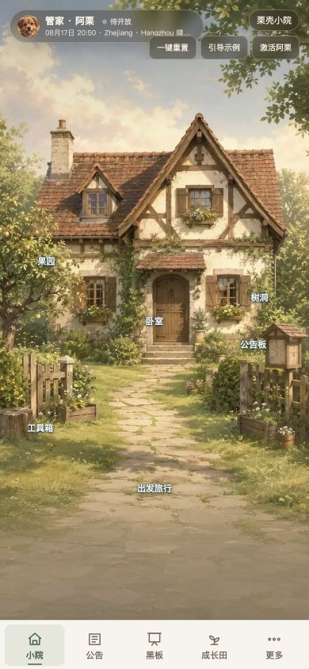

# 阿栗技术文档

这套文档同时服务两类读者：主人用它理解和操作小院，技术人员用它接手开发、部署、排错与测试。

## 阅读路径

- 想快速了解产品：先读 [PRD](01-PRD.html)，再读 [使用指南](02-使用指南.html)。
- 想接手代码：先读 [系统架构](03-系统架构.html)，再读 [模块与功能规格](04-模块与功能规格.html)。
- 想确认数据是否安全同步：读 [数据同步与安全](05-数据同步与安全.html)。
- 想维护 AI：读 [AI 与接口调用链](06-AI与接口调用链.html)。
- 想发布或验收：按 [测试与运维手册](07-测试与运维手册.html) 执行。
- 想换 Codex 账号或学习对话式构建方法：读 [Codex 协作与迁移指南](08-Codex协作与迁移指南.html)。

## 当前能力

| 项目 | 状态 | 说明 |
| --- | --- | --- |
| 私人网页版 | 已实现 | 口令会话保护，私人数据不进入仓库 |
| 手机适配与主屏幕安装 | 已实现 | 完成手机视口回归并支持 PWA |
| 结构化数据跨设备同步 | 已实现 | Cloudflare KV 为权威源，按记录合并并保留删除标记 |
| 云端备份 | 已实现 | 独立 KV 保存版本与全量快照 |
| 私人媒体永久保存 | 已实现 | 手动上传与生成媒体保存至私有 R2 |
| 面试演示版 | 已实现 | 与私人数据隔离，可重置并载入虚构示例 |

## 仓库边界

GitHub 只保存代码、公开图片、空白初始数据、测试和文档。私人记忆、树洞内容、旅行、答案、密钥、上传图片与云端快照不进入 Git。

[返回 GitHub 项目首页](https://github.com/Labixy1/chestnut-courtyard)
